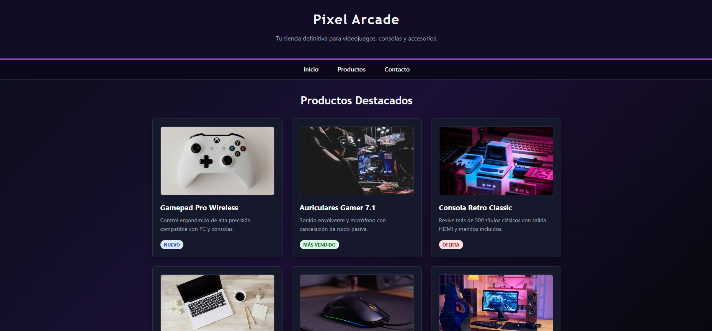
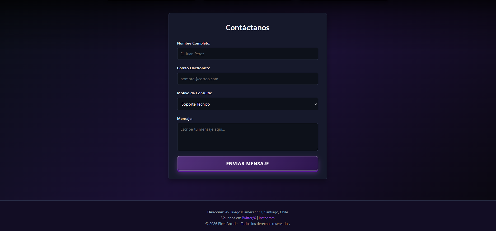
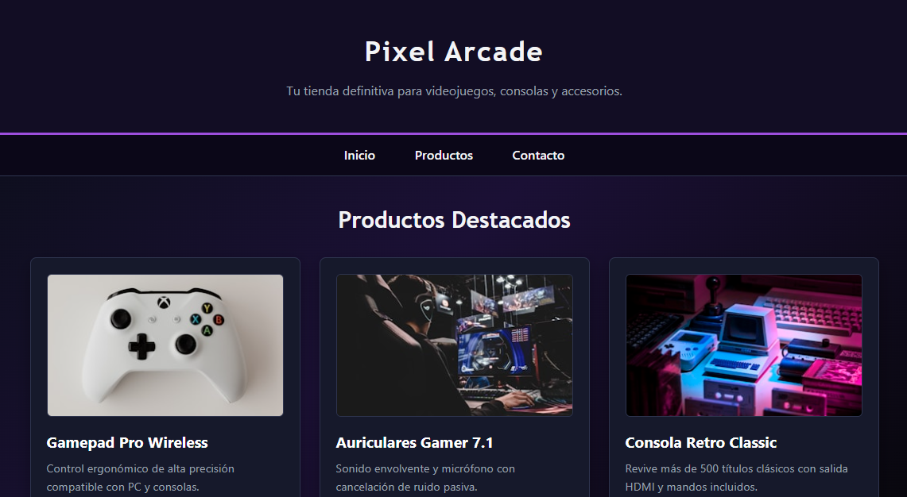
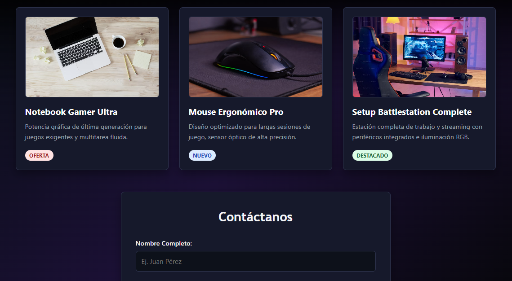
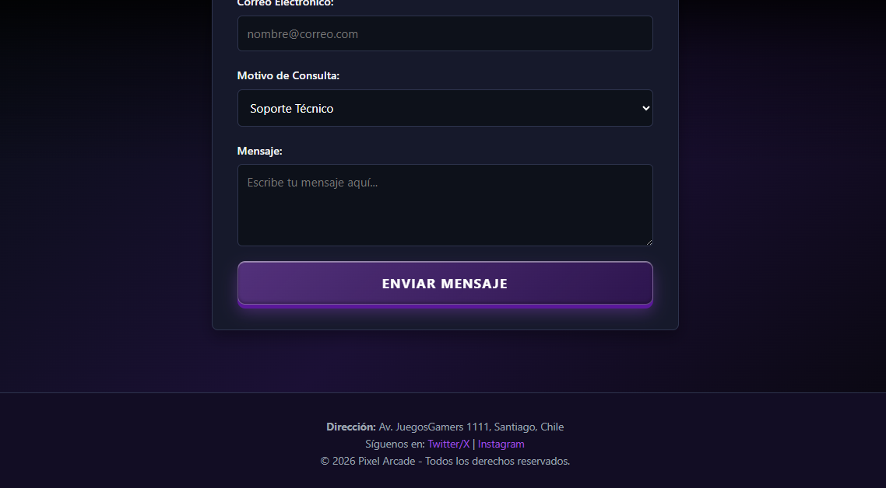
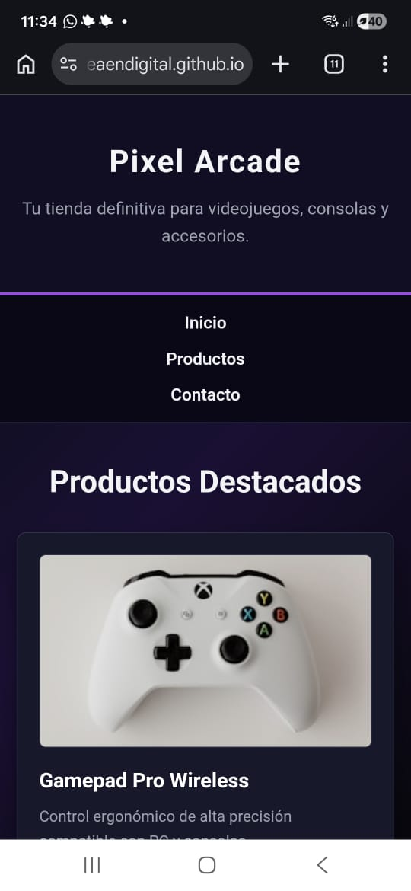
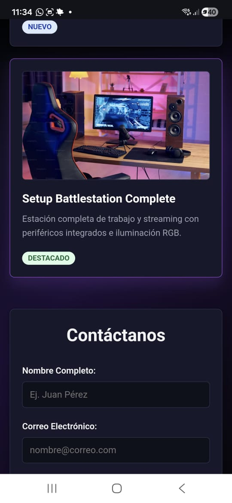
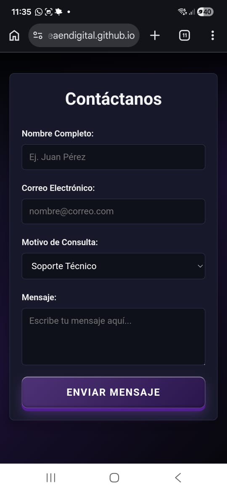

# Pixel Arcade - Semana 3

Proyecto de **Desarrollo Frontend I** correspondiente a la Semana 3: fundamentos de CSS3, diseño responsive y ampliación del catálogo.

Esta versión evoluciona la estructura HTML de las semanas anteriores mediante una hoja de estilos externa, CSS Grid, Flexbox, media queries y una identidad visual gamer basada en fondos degradados, tarjetas oscuras y efectos de interacción.

## Cambios incorporados

- Catálogo ampliado a seis productos.
- Hoja de estilos externa en `css/styles.css`.
- Variables CSS para colores, superficies, bordes y tipografías.
- Catálogo responsive con CSS Grid mediante `repeat(auto-fit, minmax(...))`.
- Navegación flexible mediante Flexbox.
- Formulario de contacto organizado con Flexbox.
- Diseño adaptable para escritorio, tablet y móvil.
- Imágenes con textos alternativos y carga diferida.
- Estados `hover` y `focus-visible` para enlaces y controles.
- Fondo degradado oscuro, tarjetas con sombras y botón con efecto glassmorphism/3D.

## Tecnologías utilizadas

| Tecnología | Aplicación |
| --- | --- |
| HTML5 | Estructura semántica, catálogo y formulario |
| CSS3 | Variables, Grid, Flexbox, media queries y efectos visuales |
| Unsplash | Imágenes públicas de productos |
| GitHub Pages | Publicación del sitio estático |

## Estructura de la semana

```text
sem03/
├── README.md
├── index.html
├── css/
│   └── styles.css
├── js/
└── img/
    ├── pc01.png
    ├── pc02.png
    ├── tablet01.png
    ├── tablet02.png
    ├── tablet03.png
    ├── movil01.jpeg
    ├── movil02.jpeg
    └── movil03.jpeg
```

## Visualización local

Abre [index.html](index.html) directamente en el navegador o utiliza **Live Server** en Visual Studio Code.

También puedes iniciar desde la raíz del repositorio:

```bash
cd sem03
```

Las imágenes de productos se cargan desde Unsplash, por lo que se necesita conexión a Internet para visualizar todos los recursos externos.

## Evidencias del avance responsive

### Escritorio - 1200 px o más

El catálogo utiliza una cuadrícula de tres columnas y la navegación se mantiene horizontal.





### Tablet - 768 px aproximadamente

La cuadrícula se adapta a dos columnas y conserva el espaciado entre productos.







### Móvil - 375 px a 600 px

El catálogo se reorganiza en una columna, la navegación se apila y el formulario se adapta al ancho disponible.







## Siguiente evolución

La Semana 4 toma esta base visual y la adapta a Bootstrap 5.3 incorporando Navbar colapsable, Carousel, Grid System y Cards. La documentación de esa entrega se encuentra en [sem04/README.md](../sem04/README.md).
