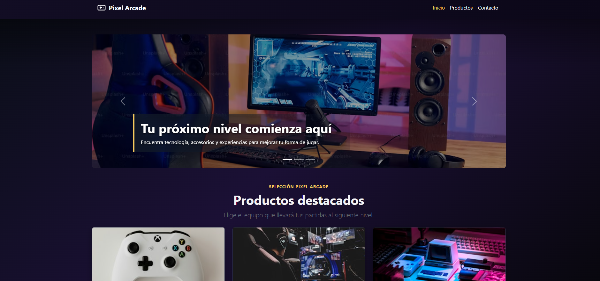
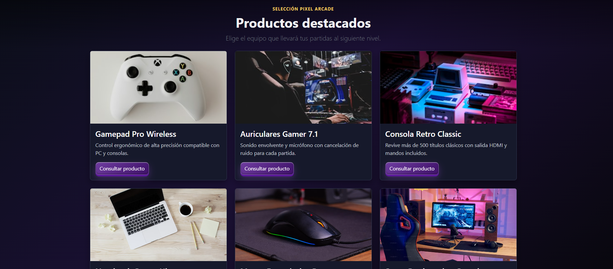
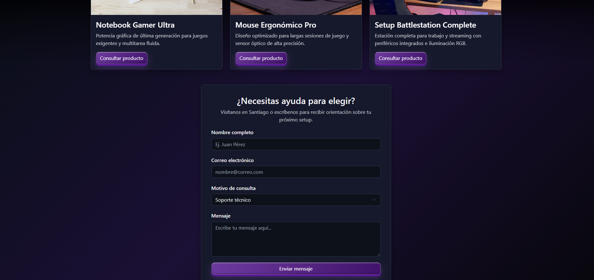
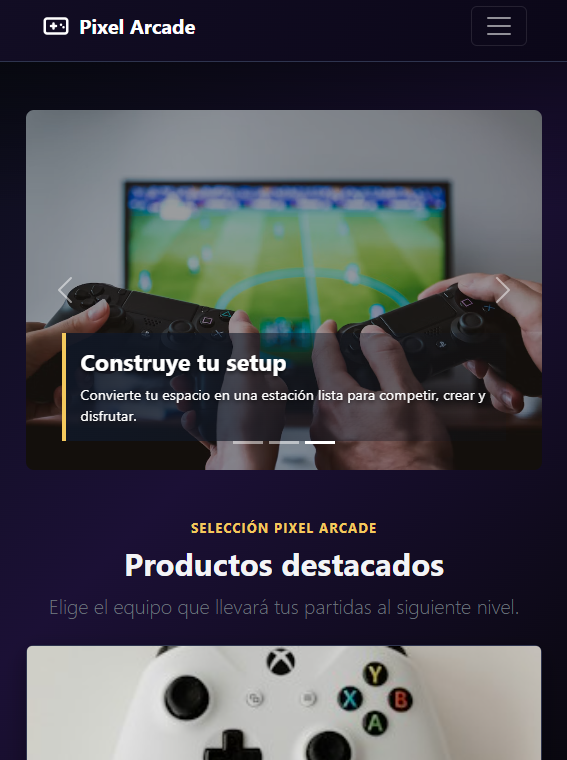
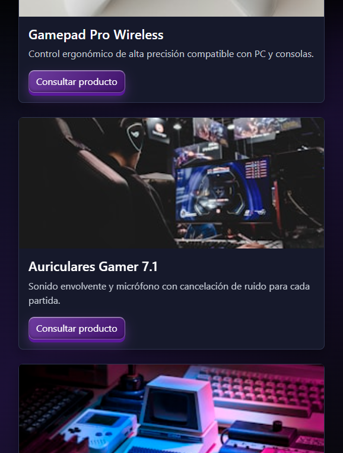
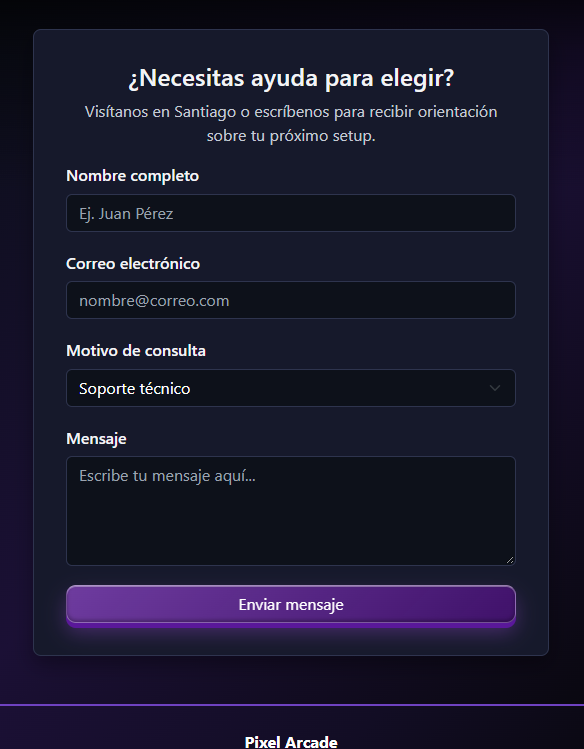

# Pixel Arcade - Semana 4

Proyecto de **Desarrollo Frontend I** correspondiente a la Semana 4: **Utilizando Bootstrap 5 para el diseño responsivo**.

Esta versión transforma la tienda Pixel Arcade en una interfaz responsive basada en Bootstrap 5.3, conservando la identidad visual gamer del proyecto original: fondo degradado oscuro, tarjetas de productos, formulario de contacto, botones con efecto glassmorphism y footer morado.

## Visualización

- [Abrir `index.html`](index.html)
- [Repositorio GitHub](https://github.com/andreaendigital/frontend01)
- [Sitio publicado en GitHub Pages](https://andreaendigital.github.io/frontend01/sem04/index.html)

## Cambios incorporados

### Barra de navegación

- Navbar de Bootstrap con `navbar-expand-lg`.
- Menú colapsable para dispositivos móviles mediante `navbar-toggler`.
- Brand Pixel Arcade con icono SVG.
- Enlaces funcionales hacia Inicio, Productos y Contacto.
- Atributos ARIA para navegación, botón toggler y estado del menú.
- Espaciado ampliado para mejorar la lectura y la interacción táctil.

### Carrusel

- Carousel de Bootstrap con tres diapositivas.
- Cambio automático cada 3 segundos mediante `data-bs-interval="3000"`.
- Imágenes públicas de Unsplash.
- Indicadores inferiores y controles anterior/siguiente.
- Textos `visually-hidden` y etiquetas ARIA para accesibilidad.
- Captions con encabezado y descripción en cada slide.
- Altura uniforme y recorte responsive mediante `object-fit: cover`.

### Sistema Grid

La sección principal utiliza:

- `<main class="container my-5">`.
- Filas con `row g-4`.
- Columnas responsive `col-12 col-md-6 col-lg-4`.
- Adaptación automática a una, dos o tres columnas según el ancho de pantalla.

### Tarjetas Cards

Se conservaron los seis productos del catálogo original utilizando:

- `card` y `h-100` para alturas homogéneas.
- `card-img-top` con textos alternativos descriptivos.
- `card-body`, `card-title` y `card-text`.
- Botones `btn btn-primary` con efecto glassmorphism y estados hover, active y focus.

### Formulario y estilo visual

Se conservó el formulario original de contacto con campos para nombre, correo, categoría y mensaje. También se mantuvieron:

- Fondo degradado gamer oscuro.
- Superficies oscuras para tarjetas y formulario.
- Bordes, sombras y acentos morados.
- Footer con degradado morado coherente con el fondo.
- Estados de foco visibles para los controles del formulario.

## Tecnologías utilizadas

| Tecnología      | Uso                                                  |
| --------------- | ---------------------------------------------------- |
| HTML5           | Estructura semántica y accesible                     |
| CSS3            | Identidad visual, responsive y efectos glassmorphism |
| Bootstrap 5.3.3 | Navbar, Carousel, Grid, Cards, botones y formulario  |
| JavaScript ES6+ | Inicialización explícita del carrusel                |
| Unsplash        | Imágenes públicas del carrusel y catálogo            |
| GitHub Pages    | Publicación estática del proyecto                    |

## Estructura de `sem04`

```text
sem04/
├── README.md
├── index.html
├── css/
│   └── styles.css
├── js/
│   └── main.js
└── img/
    └── capturas de evidencias anteriores
```

## Visualización local

1. Clona el repositorio:

   ```bash
   git clone https://github.com/andreaendigital/frontend01.git
   ```

2. Entra a la carpeta de la semana:

   ```bash
   cd frontend01/sem04
   ```

3. Abre `index.html` directamente en el navegador o utiliza la extensión **Live Server** de Visual Studio Code.

Bootstrap y las imágenes se cargan desde CDN, por lo que se necesita conexión a Internet para visualizar todos los recursos externos.

## Evidencias responsive de Semana 4

Las siguientes capturas corresponden directamente a la interfaz Bootstrap de Semana 4 y se encuentran dentro de `sem04/img/`.

### Vista de PC







### Vista móvil







Actualmente la carpeta contiene tres evidencias de PC y tres evidencias móviles. La cuarta imagen móvil mencionada todavía no está presente en `sem04/img`.
