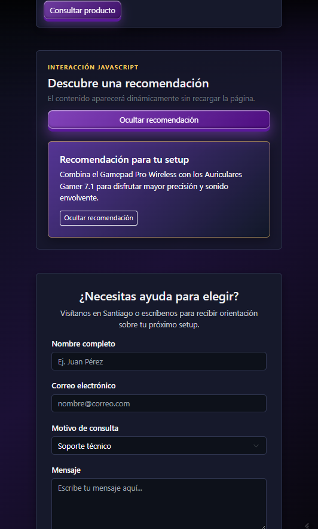

# Pixel Arcade - Semana 5

Práctica de **Desarrollo Frontend I** enfocada en JavaScript, manipulación del DOM, gestión de eventos y consumo asíncrono con Fetch API sobre la base responsive de Bootstrap 5.3.

## Auditoría del estado inicial

La página de `sem05` partía de una base funcional con:

- Estructura HTML5 semántica.
- Navbar, Carousel, Grid y Cards de Bootstrap 5.3.
- Seis productos en una cuadrícula responsive.
- Formulario de contacto con controles accesibles.
- CSS personalizado para fondo gamer, tarjetas, botones y formulario.
- JavaScript dedicado únicamente a inicializar el carrusel.

## Consumo asíncrono con Fetch API

El catálogo se carga desde el archivo local [data/products.json](data/products.json) mediante `fetch("./data/products.json")` y `async/await`.

- `fetchProducts()` encapsula la lectura de la fuente JSON.
- `createProductCard()` genera cada card con `document.createElement()` y `appendChild()`.
- `loadProducts()` controla la carga, limpia `#productGrid` y renderiza los seis artículos.
- `#productsStatus` comunica los estados de carga, éxito y error.
- El bloque `catch` muestra un mensaje visible y registra el error en consola.

El JSON contiene los mismos seis artículos del catálogo: Gamepad Pro Wireless, Auriculares Gamer 7.1, Consola Retro Classic, Notebook Gamer Ultra, Mouse Ergonómico Pro y Setup Battlestation Complete.

### Contenido inicial de respaldo

En `index.html` se mantienen solamente tres tarjetas estáticas iniciales: Gamepad Pro Wireless, Auriculares Gamer 7.1 y Consola Retro Classic. Estas funcionan como **contenido inicial de respaldo** y permiten que el catálogo tenga una estructura visible mientras se carga el archivo JSON.

Cuando `main.js` carga correctamente `products.json`, ejecuta:

```javascript
productGrid.replaceChildren();
```

Después crea las seis tarjetas dinámicamente a partir de los datos del JSON. Por eso, las tres tarjetas escritas en `index.html` se reemplazan y no se duplican. La versión final muestra seis productos porque todos provienen del catálogo completo de `products.json`, que también contiene Notebook Gamer Ultra, Mouse Ergonómico Pro y Setup Battlestation Complete.

Si `fetch()` falla, las tres tarjetas estáticas permanecen visibles como fallback. Es una estrategia válida de mejora progresiva porque la página conserva contenido útil aunque no pueda acceder temporalmente al archivo JSON.

También sería posible utilizar una fuente exclusivamente dinámica eliminando las tarjetas estáticas y dejando únicamente el contenedor:

```html
<div id="productGrid" class="row g-4"></div>
```

Sin embargo, la versión actual es más resistente porque conserva el catálogo visible si el JSON no carga.

Los puntos de inserción elegidos fueron:

- `#dynamicContent`, dentro de una sección propia antes del formulario, para crear contenido sin romper la grilla.
- `.product-card`, para aplicar interacción visual a las tarjetas existentes.
- `.contact-form`, para validar el envío y notificar el resultado al usuario.

## Funcionalidades JavaScript incorporadas

### Manipulación dinámica del DOM

El archivo `js/main.js` utiliza JavaScript moderno y métodos nativos:

- `document.createElement()` para crear una recomendación dinámica, títulos, párrafos y botones.
- Configuración de clases, propiedades y texto mediante JavaScript.
- `appendChild()` para insertar los nodos en `#dynamicContent`.
- `remove()` para ocultar y eliminar el contenido creado.

### Evento `click`

El botón **Mostrar recomendación** crea una nueva tarjeta dentro de `#dynamicContent`. Al volver a pulsarlo, la recomendación se elimina y el texto del botón cambia. También existe un botón interno para ocultarla.

### Eventos `mouseover` y `mouseout`

Cada tarjeta de producto escucha ambos eventos:

- `mouseover`: agrega la clase `is-hovered` y una etiqueta visual mediante `data-interaction`.
- `mouseout`: elimina el estado visual y el atributo temporal.

### Evento `submit`

El formulario de contacto utiliza `event.preventDefault()` para evitar un envío inexistente al servidor. Luego valida:

- Nombre no vacío.
- Correo con formato válido.
- Mensaje no vacío.

El resultado se comunica mediante un elemento creado dinámicamente con `role="status"` y `aria-live="polite"`.

## Tecnologías utilizadas

| Tecnología      | Aplicación                                         |
| --------------- | -------------------------------------------------- |
| HTML5           | Estructura semántica y puntos de inserción         |
| CSS3            | Estados visuales, responsive y accesibilidad       |
| Bootstrap 5.3.3 | Layout, Navbar, Carousel, Grid, Cards y formulario |
| JavaScript ES6+ | DOM, `createElement`, `appendChild` y eventos      |
| Fetch API       | Consumo asíncrono del catálogo local en JSON       |
| Unsplash        | Imágenes públicas del catálogo y carrusel          |

## Estructura de `sem05`

```text
sem05/
├── README.md
├── index.html
├── css/
│   └── styles.css
├── js/
│   └── main.js
├── data/
│   └── products.json
└── img/
```

## Visualización local

1. Desde la raíz del repositorio, entra a la carpeta:

   ```bash
   cd sem05
   ```

2. Abre `index.html` directamente o utiliza **Live Server** en Visual Studio Code.

3. Para probar la interacción:
   - Pulsa **Mostrar recomendación**.
   - Pasa el cursor sobre una tarjeta.
   - Completa y envía el formulario.

Bootstrap y las imágenes se cargan desde CDN, por lo que se necesita conexión a Internet para visualizar todos los recursos externos.

## Evidencias de la implementación

Las capturas disponibles en `sem05/img/` documentan la carga dinámica del catálogo, la interacción JavaScript y la adaptación responsive.

### Vista PC


En esta captura se observa el mensaje **“6 productos cargados correctamente.”**, que confirma que `products.json` fue consumido mediante Fetch API y que los seis productos fueron renderizados en el DOM.


En esta captura se observa el mensaje **“Completa tu nombre, un correo válido y el mensaje antes de enviar.”** al intentar enviar el formulario sin incorporar el mensaje requerido.

### Vista móvil




Actualmente se encuentran disponibles cuatro capturas de PC y dos capturas móviles dentro de la carpeta `sem05/img/`.
