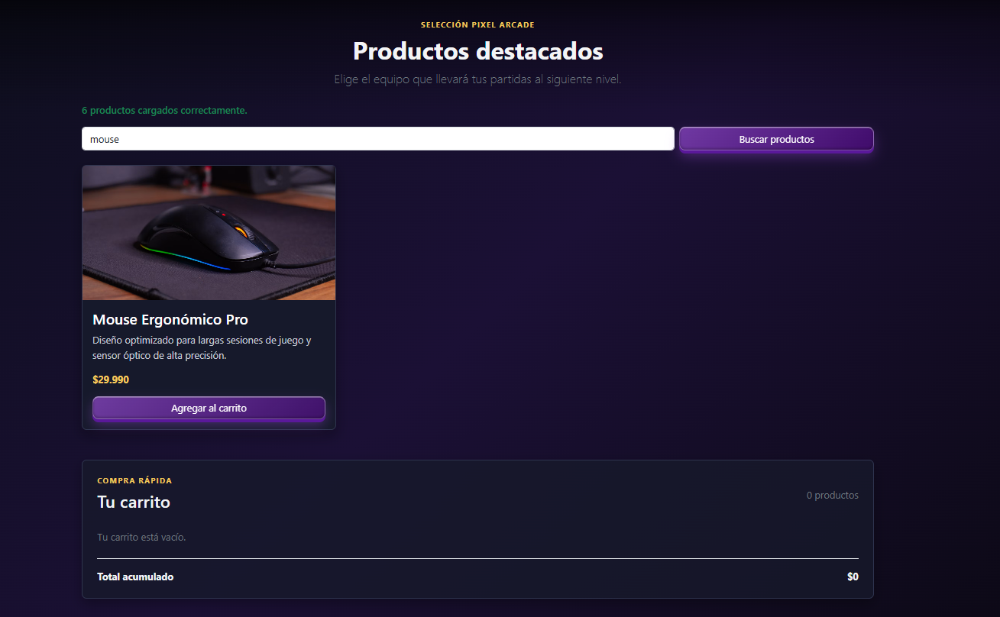
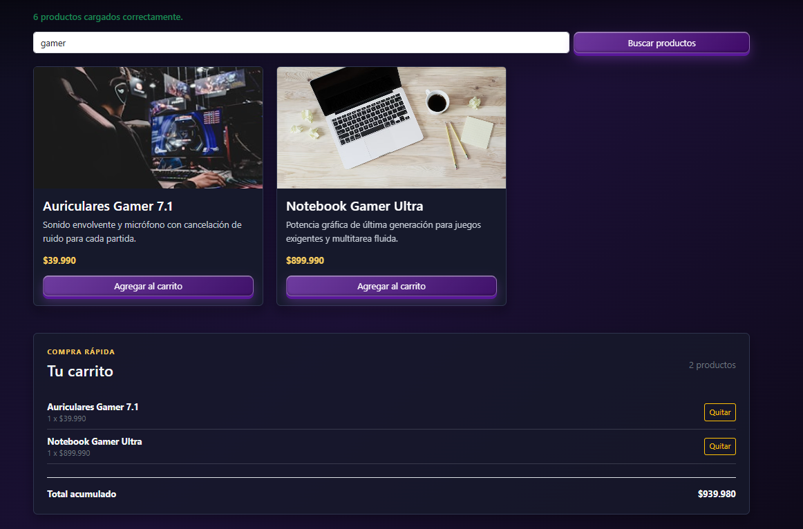
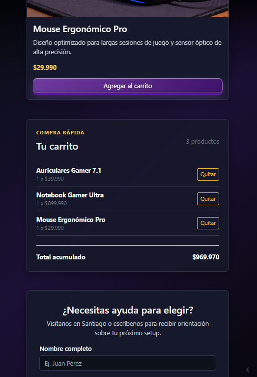

# Pixel Arcade - Semana 6

Entrega de **Desarrollo Frontend I** enfocada en Bootstrap 5, manipulación del DOM, carrito de compras, búsqueda de productos y consumo asíncrono con Fetch API.

## Requerimientos implementados

### Estructura y Bootstrap 5

- Layout responsive mobile-first con Bootstrap 5.3.
- Navbar con las categorías Inicio, Productos, Carrito y Contacto.
- Menú móvil mediante `navbar-toggler` y `collapse`.
- Cards Bootstrap organizadas con Grid responsive.
- Footer con dirección, correo de contacto, Instagram y copyright.
- Estructura de carpetas basada en `assets/`.

```text
sem06/
├── README.md
├── index.html
└── assets/
    ├── css/
    │   └── styles.css
    ├── data/
    │   └── products.json
    ├── img/
    └── js/
        └── main.js
```

### Catálogo con Fetch API

El catálogo se carga desde [assets/data/products.json](assets/data/products.json) mediante `fetch()` y `async/await`.

- `fetchProducts()` consume y valida la respuesta HTTP.
- `loadProducts()` administra la carga y los estados de la interfaz.
- `renderProducts()` actualiza la grilla sin recargar la página.
- `createProductCard()` genera las cards desde los datos JSON.
- El bloque `catch` muestra un mensaje amigable cuando el catálogo falla.

### Búsqueda de productos

El formulario `#searchForm` gestiona el evento `submit` con `event.preventDefault()`. La búsqueda compara el texto ingresado con el nombre y la descripción de cada producto, y luego renderiza únicamente los resultados coincidentes.

### Carrito dinámico

El carrito se actualiza mediante eventos y manipulación del DOM:

- El estado se mantiene en memoria mediante el array `cart`.
- El botón **Agregar al carrito** utiliza un evento `click`.
- El contador de productos se actualiza en `#cartCount`.
- Los productos agregados se muestran en `#cartItems`.
- El total acumulado se actualiza en `#cartTotal`.
- Cada producto incluye un botón **Quitar**.
- `renderCart()` vuelve a pintar el resumen después de agregar o quitar productos.
- Se controla la cantidad de unidades cuando se agrega un mismo producto más de una vez.
- `reduce()` calcula el total y la cantidad acumulada.
- `splice()` elimina productos cuando su cantidad llega a cero.
- La delegación de eventos permite quitar productos creados dinámicamente.

#### Correspondencia con la pauta

La implementación utiliza nombres semánticos equivalentes a los ejemplos de la pauta:

| Pauta | Implementación |
| --- | --- |
| `carrito` | `cart` |
| `actualizarResumenCarrito()` | `renderCart()` |
| `lista-carrito` | `cartItems` |
| `total-compra` | `cartTotal` |
| `contador-productos` | `cartCount` |

En lugar de `innerHTML = ""`, se utiliza `replaceChildren()` para limpiar el contenedor antes de renderizar. El resultado funcional es el mismo y evita interpretar HTML innecesario.

## Visualización local

Desde la raíz del repositorio:

```bash
cd sem06
```

Abre `index.html` con Live Server o cualquier servidor local para permitir que `fetch()` lea `assets/data/products.json`.

Pruebas recomendadas:

1. Buscar un producto por nombre o descripción.
2. Pulsar **Agregar al carrito** en varias cards.
3. Comprobar contador, lista y total acumulado.
4. Pulsar **Quitar** y verificar que el resumen se actualiza.
5. Simular un error cambiando temporalmente la ruta del JSON y comprobar el mensaje de error.

## Evidencias de la implementación

Las capturas de `assets/img/` muestran las funcionalidades de búsqueda y carrito en escritorio y móvil.

### Búsqueda de productos en PC



La captura muestra la búsqueda de **mouse**, el resultado filtrado y el mensaje de carga correcta del catálogo.

### Carrito dinámico en PC



La captura muestra productos agregados, contador, botones **Quitar** y el total acumulado actualizado.

### Búsqueda responsive en móvil


La captura evidencia el formulario de búsqueda adaptado a una columna en pantalla móvil.

### Carrito responsive en móvil



La captura evidencia el resumen del carrito en móvil con productos, cantidades, botones **Quitar** y total acumulado.

## Tecnologías

| Tecnología      | Uso                                           |
| --------------- | --------------------------------------------- |
| HTML5           | Estructura semántica y accesible              |
| Bootstrap 5.3   | Navbar, Grid, Cards, botones y responsive     |
| CSS3            | Identidad visual y estilos del carrito        |
| JavaScript ES6+ | Fetch, eventos, funciones reutilizables y DOM |
| JSON            | Datos locales del catálogo                    |
