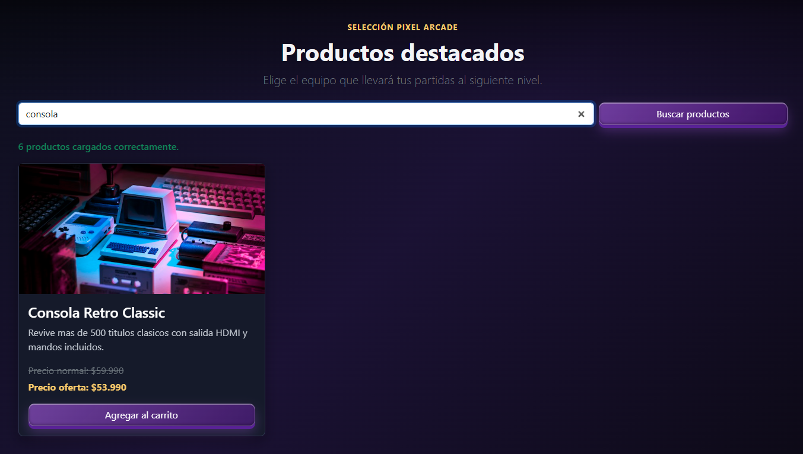
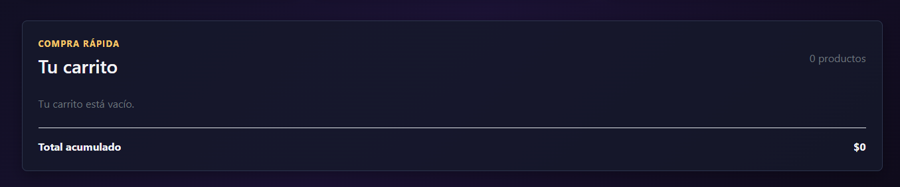

# Pixel Arcade - Semana 8

## Evolución del proyecto

Durante la semana 8, Pixel Arcade continúa la evolución iniciada en la semana 7 con una aplicación React organizada con Vite. El objetivo de esta actividad es optimizar los componentes usando `useState`, `useEffect` y renderizado condicional.

La interfaz visual se conserva con Bootstrap 5.3 y los estilos personalizados de Pixel Arcade. Las mejoras se concentran en la gestión de datos, estados internos y comportamiento interactivo.

## Objetivos implementados

- Cargar dinámicamente el catálogo desde un archivo JSON local.
- Administrar la lista de productos con estado React.
- Administrar los productos seleccionados en el carrito.
- Mostrar un contador con el total de productos agregados.
- Agregar y eliminar productos del carrito.
- Mostrar un mensaje cuando el carrito está vacío.
- Cambiar el texto del botón a `En el carrito` después de agregar un producto.
- Mantener todos los botones con el estilo morado `btn-primary`.
- Mostrar estados de carga, éxito y error del catálogo.

## Estructura de la semana 8

```text
sem08/
├── index.html
├── package.json
├── package-lock.json
├── vite.config.js
├── public/
│   └── products.json
└── src/
    ├── App.css
    ├── App.jsx
    ├── index.css
    ├── main.jsx
    ├── assets/
    │   ├── styles.css
    │   └── img/
    │       ├── busqueda.png
    │       ├── carritovacio.png
    │       └── enelcarrito.png
    └── components/
        ├── CartTotal.jsx
        ├── Counter.jsx
        ├── ProductList.jsx
        ├── ShoppingCart.jsx
        └── UserStatus.jsx
```

La carpeta `public/` contiene `products.json`. Vite copia su contenido directamente al resultado final, por lo que puede ser solicitado mediante `fetch()`.

## Gestión de estados con `useState`

En `App.jsx`, la lista comienza vacía y se actualiza cuando finaliza la carga del JSON:

```jsx
const [products, setProducts] = useState([]);
const [loadingProducts, setLoadingProducts] = useState(true);
const [productsError, setProductsError] = useState(false);
```

En `ShoppingCart.jsx`, el carrito y la búsqueda se mantienen como estados internos:

```jsx
const [cart, setCart] = useState([]);
const [searchTerm, setSearchTerm] = useState("");
```

Cada producto agregado recibe un `uniqueId`, lo que permite agregar varias unidades y eliminar una entrada específica:

```jsx
const addToCart = (product) => {
  const uniqueId = `${product.id}-${Date.now()}-${Math.random()}`;
  const nextCart = [...cart, { ...product, uniqueId }];
  setCart(nextCart);
  onCountChange(nextCart.length);
};
```

La eliminación utiliza `filter()`:

```jsx
const removeFromCart = (uniqueId) => {
  const nextCart = cart.filter((product) => product.uniqueId !== uniqueId);
  setCart(nextCart);
  onCountChange(nextCart.length);
};
```

## Manejo de efectos con `useEffect`

`App.jsx` utiliza `useEffect` para simular la carga de datos desde una fuente externa local:

```jsx
useEffect(() => {
  fetch(`${import.meta.env.BASE_URL}products.json`)
    .then((response) => {
      if (!response.ok) throw new Error(`Error ${response.status}`);
      return response.json();
    })
    .then((data) => setProducts(data))
    .catch((error) => {
      setProductsError(true);
      console.error("No se pudo cargar el catálogo", error);
    })
    .finally(() => setLoadingProducts(false));
}, []);
```

El arreglo vacío `[]` indica que el efecto se ejecuta al montar el componente. Al finalizar, la interfaz deja de mostrar la carga y presenta los productos o el mensaje de error.

## Estados visibles del catálogo

`UserStatus.jsx` presenta un mensaje distinto según el estado:

```jsx
function UserStatus({ loading, error, count }) {
  if (loading) return <p>Cargando productos...</p>;
  if (error) return <p>No fue posible cargar los productos.</p>;
  return <p>{count} productos cargados correctamente.</p>;
}
```

El componente se utiliza desde `ShoppingCart.jsx`:

```jsx
<UserStatus
  count={products.length}
  loading={loadingProducts}
  error={productsError}
/>
```

## Renderizado condicional

### Catálogo sin resultados

`ProductList.jsx` filtra el catálogo con el texto de búsqueda. Si no existen coincidencias, muestra un mensaje alternativo:

```jsx
if (filteredProducts.length === 0) {
  return (
    <p className="text-warning">No encontramos productos con esa búsqueda.</p>
  );
}
```

Cuando existen productos, se utiliza `.map()`:

```jsx
{
  filteredProducts.map((product) => (
    <article key={product.id} className="card product-card">
      <h3>{product.name}</h3>
    </article>
  ));
}
```

### Botón `Agregar al carrito` / `En el carrito`

Cada tarjeta comprueba si su producto está incluido en el estado `cart`:

```jsx
{
  cart.some((item) => item.id === product.id)
    ? "En el carrito"
    : "Agregar al carrito";
}
```

El botón siempre mantiene el estilo morado:

```jsx
<button
  type="button"
  className="btn btn-primary mt-auto"
  onClick={() => onAddToCart(product)}
>
  {cart.some((item) => item.id === product.id)
    ? "En el carrito"
    : "Agregar al carrito"}
</button>
```

El cambio afecta únicamente al texto. No se cambia a `btn-secondary`, por lo que todos los botones mantienen la apariencia visual original.

### Carrito vacío

`ShoppingCart.jsx` muestra un mensaje cuando no hay productos y las entradas cuando existen:

```jsx
{
  cart.length === 0 ? (
    <p className="text-secondary mb-0">Tu carrito está vacío.</p>
  ) : (
    cart.map((product) => (
      <div key={product.uniqueId} className="cart-item">
        <strong>{product.name}</strong>
        <button onClick={() => removeFromCart(product.uniqueId)}>Quitar</button>
      </div>
    ))
  );
}
```

## Contador y total

El contador se actualiza desde `ShoppingCart` mediante `onCountChange` y se muestra en la navegación con `Counter`:

```jsx
<Counter count={cartCount} />
```

El total del carrito se calcula en `CartTotal.jsx` con `reduce()`:

```jsx
const total = cart.reduce((sum, product) => sum + product.offerPrice, 0);
```

## Ejecutar el proyecto

Los comandos deben ejecutarse desde la carpeta `sem08`, donde se encuentra `package.json`:

```bash
cd sem08
npm install
npm run dev -- --host 127.0.0.1 --port 5174
```

Con esta configuración, la aplicación se abre en:

```text
http://127.0.0.1:5174/frontend01/sem08/
```

Si el puerto `5174` está ocupado, Vite puede iniciar en otro puerto. En ese caso se debe abrir la URL que aparece en la terminal, conservando la ruta `/frontend01/sem08/`.

Para crear la compilación de producción:

```bash
npm run build
```

Para previsualizar la compilación:

```bash
npm run preview
```

## Evidencias de funcionamiento

Las siguientes capturas muestran las funcionalidades implementadas durante la semana 8.

### Búsqueda de productos



La captura muestra la búsqueda del término `consola`. El catálogo filtra los productos y presenta únicamente `Consola Retro Classic`, manteniendo sus precios y el botón morado `Agregar al carrito`.

### Producto agregado al carrito


La captura muestra productos en el catálogo después de una interacción. El botón del `Setup Battlestation Complete` cambió de `Agregar al carrito` a `En el carrito`, mientras el botón del mouse aún permanece disponible. Ambos conservan el estilo morado `btn-primary`.

### Carrito vacío



La captura muestra el renderizado condicional del carrito vacío: aparece el mensaje `Tu carrito está vacío`, el contador indica `0 productos` y el total acumulado muestra `$0`.

## Tecnologías

| Tecnología    | Uso                                               |
| ------------- | ------------------------------------------------- |
| React         | Componentes y renderizado declarativo             |
| Vite          | Servidor de desarrollo y compilación              |
| `useState`    | Estado del catálogo, búsqueda, carrito y contador |
| `useEffect`   | Carga simulada de productos desde JSON            |
| JSX           | Estructura de los componentes                     |
| Bootstrap 5.3 | Grid, cards, navbar y botones                     |
| JavaScript    | `.map()`, `.filter()`, `.some()` y `.reduce()`    |
